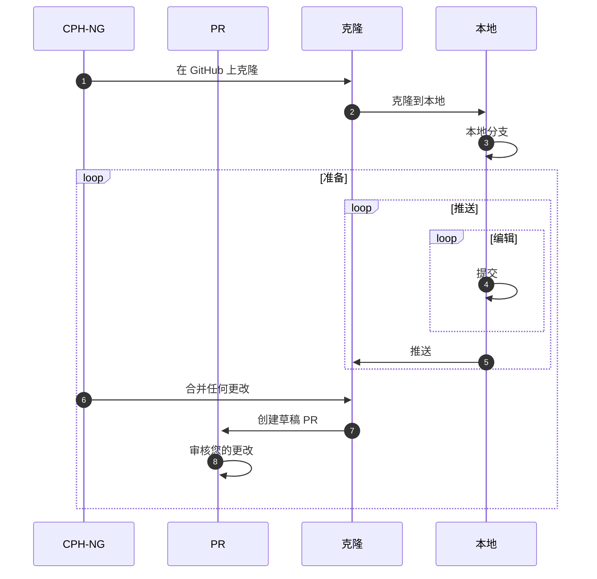
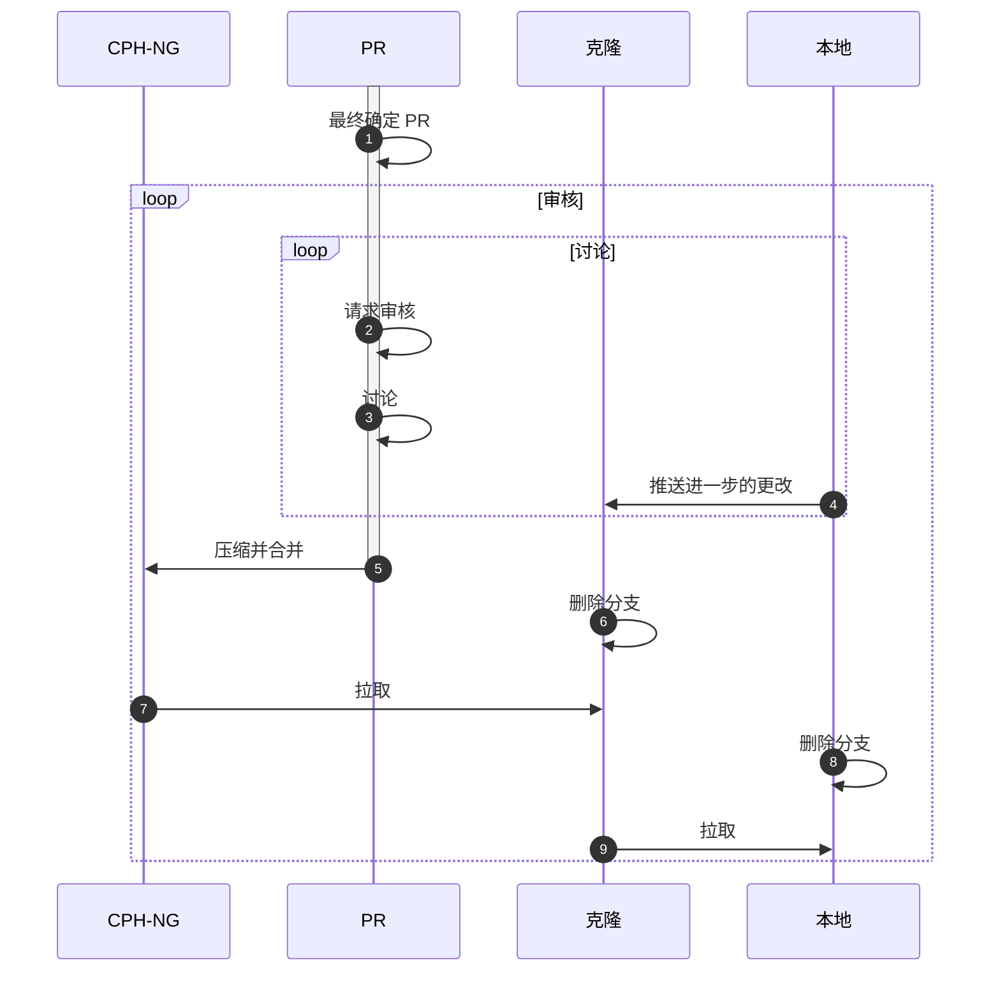

# 拉取请求 

您可以通过创建 [拉取请求] 来为 CPH-NG 贡献力量，该请求将由维护者审核，并在您所做的更改获得批准后集成到主仓库中。您可以贡献错误修复、文档更改或您开发的新功能。

[拉取请求]:https://docs.github.com/zh/pull-requests

!!! note "考虑拉取请求"

    在决定花费精力进行更改和创建拉取请求之前，请先讨论您打算做什么。如果您认为可能是错误并打算处理，请先提交一个 [错误报告]。如果您打算处理文档，请创建一个 [文档问题]。如果您想开发一个新功能，请创建一个 [变更请求]。

    请牢记所提供的指导，并让人们为您提供建议。可能存在解决您察觉并希望解决的问题的更简单方案。您可能希望实现的目标已经可以通过 [配置] 来完成。

[错误报告]: reporting-a-bug.md
[文档问题]: reporting-a-docs-issue.md
[更变请求]: feature-request.md
[配置]: ../configuration

## 了解拉取请求 { #introduction }

拉取请求是 Git 托管服务在 Git 之上增加的一个概念。在考虑创建拉取请求之前，您应该熟悉我们正在使用的服务 GitHub 上的文档。以下文章尤其重要：

1. [克隆仓库]
2. [从克隆创建拉取请求]
3. [创建拉取请求]

请注意，它们为不同的操作系统和与 GitHub 交互的不同方式提供了定制的文档。我们在本文档中会尽力描述适用于 Material for MkDocs 的流程，但无法涵盖所有可能的工具组合和操作方式。继续之前，您理解拉取请求的一般概念也很重要。

[克隆仓库]:https://docs.github.com/zh/get-started/quickstart/fork-a-repo
[从克隆创建拉取请求]: https://docs.github.com/zh/pull-requests/collaborating-with-pull-requests/proposing-changes-to-your-work-with-pull-requests/creating-a-pull-request-from-a-fork
[创建拉取请求]: https://docs.github.com/zh/pull-requests/collaborating-with-pull-requests/proposing-changes-to-your-work-with-pull-requests/creating-a-pull-request

## 拉取请求流程 { #flow }

接下来，我们将描述创建拉取请求的一般流程。这里的目标是提供一个概览，然后再描述细节。

### 准备更改和草稿 PR { #prepare-change-and-draft }

下图描述了在准备拉取请求过程中仓库通常会发生的情况。我们将在下面讨论审核-修改过程。在您担心具体的命令之前，理解整个过程是很重要的。这就是为什么我们在提供说明之前先介绍这一点。

1. 第一步是您创建一个 [CPH-NG 仓库] 的克隆（fork）。这为您提供了一个可以推送更改的仓库。
   请注意，在任何时间点，一个给定的仓库不可能有多个克隆。因此，您创建的克隆将是您拥有的*那个*克隆。
2. 一旦创建完成，将其克隆到您的本地机器，以便您可以开始处理您的更改。
3. 所有贡献都应该通过一个“主题分支”（topic branch）进行，分支名称应描述正在进行的工作。
   这允许您同时进行多项工作，如果您使用的是公共版本，也可以清楚地向其他人表明其中包含的代码是正在进行的工作。
   主题分支的生命周期会相对较短，当您的更改被整合到代码库中后，它就会消失。
4. 如果您打算进行任何代码更改，而不是仅仅处理文档，您将需要 [设置一个开发环境]。
5. 接下来是迭代过程：进行编辑，将它们提交到您的克隆中。请以构成一件工作的合理块进行提交，而不是一次性提交所有内容。
   请记住，细粒度、增量的提交比涉及许多文件、到处都是的大规模更改更容易审核。尽量保持您的更改尽可能小和局部化，并在提交时考虑到审核者。特别是，请确保编写有意义的提交消息。
6. 定期将您的工作推送到您的克隆。
7. 您还应该关注您克隆的 CPH-NG 仓库中的更改。如果您的工作需要一段时间，这一点尤其重要。
   请尝试定期将任何并发更改合并到您的克隆和您的分支中。
   您*必须*在创建拉取请求之前至少执行一次此操作，因此请更频繁地执行此操作，以最大限度地减少冲突更改的风险，从而让您的工作更轻松。
8. 一旦您对您的更改状态感到满意，可以将其描述在一个*草稿*拉取请求中，您就应该创建它。
   请务必引用引起您工作的任何先前讨论或问题。
   创建草稿是及时从维护者或其他人那里获得*早期*反馈的好方法。
   您可以在认为重要的节点明确请求审核。
9. 像您是审核者一样审核您的工作，并修复到目前为止您工作中的任何问题。批判性地查看您已更改文件的差异。
   特别是，关注更改是否尽可能小，以及您是否遵循了项目中使用的通用编码风格。如果您收到了反馈，请根据需要迭代到目前为止的过程。
   您应该选择一些项目来测试您的更改。您绝对应该确保更改不会破坏 CPH-NG 的文档构建（您可以在 `docs` 文件夹中找到）。

[CPH-NG 仓库]:https://github.com/langnignchen/cph-ng
[设置一个开发环境]:(setting-up-dev-env.md)

### 最终确定 { #final-decision }

一旦您对您的更改感到满意，就可以进入下一步：最终确定您的拉取请求并请求更正式和详细的审核。下图显示了该流程：

1. 当您满意所做的更改构成了维护者可以集成到代码库中的贡献时，请最终确定拉取请求。这向所有人表明工作已“完成”，可以进行审核并考虑接受和集成。
2. 向维护者 `@langningchen` 请求审核。
3. 维护者可能会对您的代码提出评论，您应该与他们讨论。
   在这样做时，请记住维护者可能与您的观点不同。
   他们通常会从维护项目未来几年的更长远角度出发，而您可能更专注于您所处理的特定问题或功能。请始终保持讨论的尊重。
   需要注意的是，并非所有拉取请求都会被整合到代码库中。原因可能各不相同。
   工作可能会暴露阻碍拉取请求集成的其他问题。有时它有助于发现更好的做事方式或表明需要更通用的方法。
   所有这些都很好，有助于项目进展，即使特定的更改最终没有被接受。
4. 通过将任何请求的更改提交到您的本地克隆并推送到您的克隆，来进行所需的更改。
   这会自动更新拉取请求。您的贡献可能需要多次迭代才能达到可接受的状态。
   您可以通过仔细阅读所提出的评论并谨慎地进行更改来加快此过程。
5. 一旦审核者对更改完全满意，他们就可以将它们合并到主分支。
   在此过程中，他们可能会将您的提交“压缩”成更少的提交，并可能编辑描述它们的提交消息。
   恭喜您，您现在已为该项目做出了贡献，并应该在主分支中看到以您的名义进行的更改。
6. 您现在可以删除克隆和您的本地仓库，并在下次重新开始。
   或者，您可以保留仓库和本地克隆，但在进行任何后续工作时，保持它们与上游仓库同步是很重要的。
   我们建议您从删除您在克隆上使用的分支开始。
7. 为了确保您拥有您所做的更改，请将它们从主仓库拉取到您的克隆的主分支。
8. 同样，从您的本地克隆中删除主题分支。
9. 将更改拉取到其 master 分支。

## 应该做和不应该做 { #should-should-not }

1. **不要**：仅仅创建一个没有解释更改的拉取请求。
2. **应该**：在讨论中与人们讨论您打算做什么，以便在您编写或修改代码之前，任何更改的理由都是清楚的。
3. **应该**：链接到讨论或任何问题，以为拉取请求提供背景信息。
4. **应该**：如果您对任何事情不确定，请提问。
5. **应该**：问自己您正在做的事情是否有利于更广泛的社区，并使 CPH-NG 成为更好的产品。
6. **应该**：问自己进行更改的成本是否与它们将带来的好处具有良好的关系。
   一些原本合理的更改可能会增加复杂性而收益相对较小，可能会破坏现有行为，或者在需要进行其他更改时可能会很脆弱。
7. **应该**：经常合并并发更改，以最大限度地减少难以解决的冲突更改的可能性。
