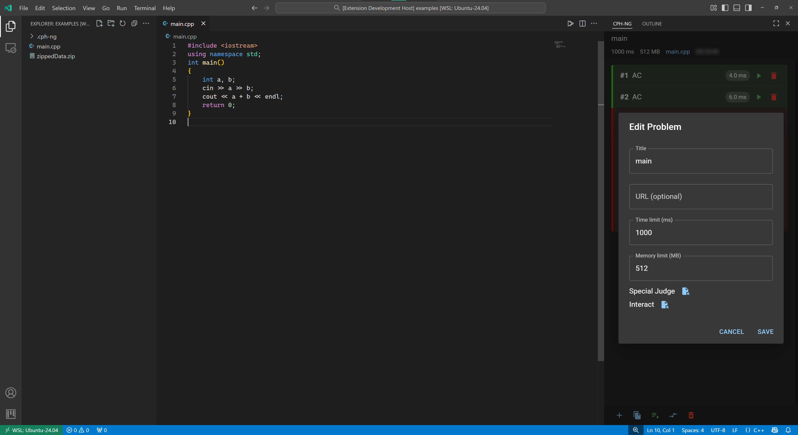

# 编辑题目

修改题目元数据，包括标题、URL、时间限制、内存限制和特殊评测设置。

## 描述 { #description }

编辑题目功能允许您在创建后修改题目的各个方面。您可以更改题目名称、URL、执行限制，以及配置高级功能，如特殊评测（SPJ）检查器和交互式题目的交互器。

## 交互 { #interaction }

### 触发功能 { #dispatch }

点击题目操作面板顶部，鼠标移动至标题栏上并点击编辑按钮

### 前置条件 { #requirements }

- 当前文件必须已加载题目
- 题目面板必须在侧边栏中可见

## 相关配置 { #configurations }

- [cph-ng.problem.defaultTimeLimit](../configuration/problem.md#defaultTimeLimit)
- [cph-ng.problem.defaultMemoryLimit](../configuration/problem.md#defaultMemoryLimit)

## 错误处理 { #error-handling }

此功能不会引发错误。

## 相关功能 { #relatives }

- [创建题目](create-problem.md)
- [特殊评测](special-judge.md)
- [交互式题目](interactive-problems.md)
- [删除题目](delete-problem.md)
