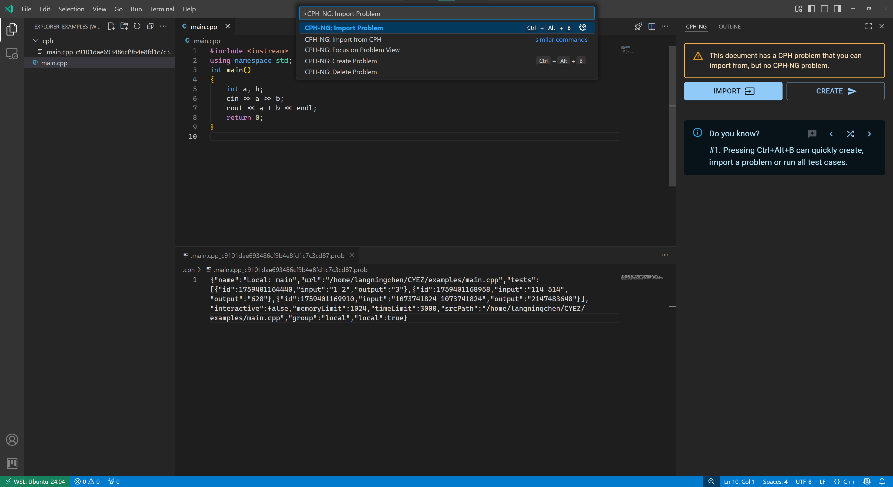
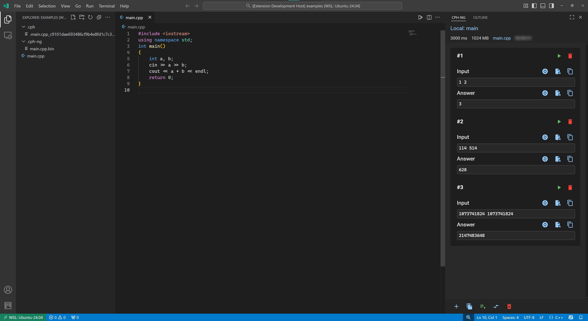

# 导入题目

从原始 CPH 扩展格式导入题目。

!!! note
     题目导入是单向的，编辑 CPH-NG 的题目不会使得 CPH 原本题目数据改变。

## 描述 { #description }

导入题目功能允许您将题目从原始 CPH (1) 扩展迁移到 CPH-NG。它读取与源代码关联的 CPH 题目文件，并将其转换为 CPH-NG 格式，包括所有测试用例和元数据。
{ .annotate }

1.  Competitive Programming Helper

## 交互 { #interaction }

### 触发功能 { #dispatch }

该功能可以通过多种方式触发：

- 打开一个没有题目的源文件并点击 CPH-NG 侧边栏面板中的 `导入` 按钮。
- 按 <kbd>F1</kbd> 或者 <kbd>Ctrl/Cmd+Shift+P</kbd> 打开命令面板，并输入并选择：`CPH-NG: 导入题目`
- 打开一个没有题目的源文件并按 <kbd>Ctrl/Cmd+Alt+B</kbd> 快捷键
- 打开一个没有题目的源文件中点击右上角的火箭图标

### 前置条件

- 必须有一个打开源文件的编辑器处于活动状态
- 此文件不应已存在题目
- 该源文件必须存在 CPH 题目文件
- CPH 题目文件必须是有效格式

## 相关配置 { #configurations }

- [cph-ng.problem.problemFilePath](../configuration/problem.md#problemFilePath)

## 错误处理 { #error-handling }

| 错误 | 原因 | 解决方案 |
|:----:|:---:|:-------:|
| 没有活动编辑器 | 当前没有打开文件 | 打开源文件后重试 |
| 题目已存在 | 此源文件的题目文件已存在 | 先删除现有题目或使用其他文件 |
| 没有导入按钮 | 源文件不存在 CPH 题目文件 | 改用创建题目，或确保 CPH 数据存在 |
| 无效的 CPH 文件 | CPH 文件损坏或格式错误 | 检查 CPH 文件完整性或从头开始重新创建 |

*[没有活动编辑器]:未找到活动编辑器，请打开一个文件以创建题目。
*[题目已存在]:该文件已存在题目。
*[无效的 CPH 文件]:加载 CPH 题目失败。

## 相关功能 { #relatives }

- [创建题目](create-problem.md) - 如果没有 CPH 数据的替代方案
- [编辑题目](edit-problem.md) - 修改导入的题目元数据
- [CPH 导入](cph-import.md) - 使用命令从 CPH 批量导入
