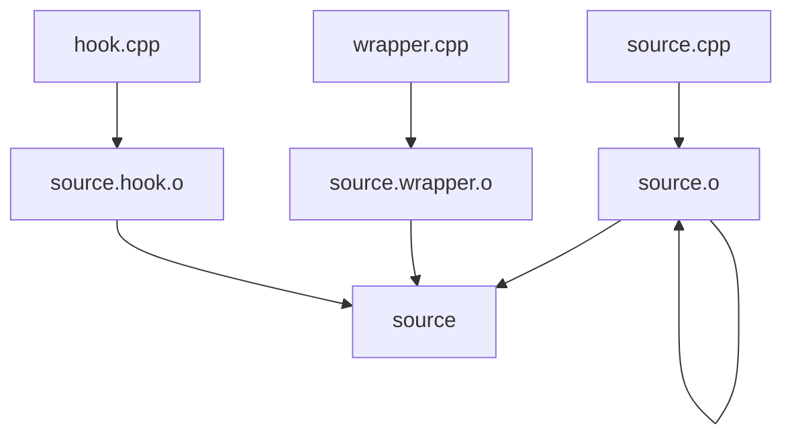

# 包装脚本 / 运行器

!!! warning "实验性功能"
    此功能为实验性功能，目前仅适用于 C/C++ 程序，不支持 MacOS 操作系统，而且没有经过稳定测试，请谨慎使用。

使用包装脚本或运行器来运行代码。

## 描述 { #description }

包装脚本与运行器的设计初衷都是能够给程序运行时提供更多的能力。

两个因为技术原因，不可同时开启。开启 [cph-ng.compilation.useWrapper](../configuration/compilation.md#useWrapper) 选项以启用包装脚本。开启 [cph-ng.runner.useRunner](../configuration/runner.md#useRunner) 选项以启用运行器。

| 功能         | 不开启 | 开启包装脚本 | 开启运行器 |
|:-------------|:-----:|:----------:|:---------:|
| 精确的时间测量 | :material-close:{ style="color: #EF5350" } | :material-check:{ style="color: #4DB6AC" } | :material-check:{ style="color: #4DB6AC" } |
| 内存测量      | :material-close:{ style="color: #EF5350" } | :material-close:{ style="color: #EF5350" } | :material-check:{ style="color: #4DB6AC" } |
| 交互题        | :material-check:{ style="color: #4DB6AC" } | :material-check:{ style="color: #4DB6AC" } | :material-close:{ style="color: #EF5350" } |
| 文件钩子      | :material-close:{ style="color: #EF5350" } | :material-check:{ style="color: #4DB6AC" } | :material-close:{ style="color: #EF5350" } |
| 无限栈空间    | :material-close:{ style="color: #EF5350" } | :material-check:{ style="color: #4DB6AC" } | :material-check:{ style="color: #4DB6AC" } |

!!! warning "性能影响"
    - 包装脚本会在编译时稍微降低编译速度
    - 运行器会在第一次运行时预编译，运行时增大系统处理器、内存与磁盘操作的开销。

### 精确的时间测量 { #precise-time-measurement }

默认的时间测量是使用墙钟时间，测量精度受限于操作系统。
使用包装脚本后，会更改 C/C++ 文件的编译流程。在原本的 `main` 函数外包裹一层使用 `std::chrono::high_resolution_clock` 的时间测量函数。这个时间最接近于主函数的运行时间。
使用运行器后，会通过一个额外的运行器程序调用编译后的选手源代码。这个时间最接近于一般 OJ 检测的时间。
包装脚本测量出的时间最短，运行器其次，这两者都远小于墙钟时间。

### 内存测量 { #memory-measurement }

运行器能够在选手程序退出后进行内存测量。

### 文件钩子 { #file-hook }

使用特殊的编译流程将 `fopen` `freopen` `open` 函数替换为没有任何操作[^1]。这样选手调用文件操作是会被阻拦，从而能够正常从样例加载测试数据运行。开启 [cph-ng.compilation.useHook](../configuration/compilation.md#useHook) 选项以启用此功能。

[^1]: `ifstream` `ofstream` 等 `std` 函数的内部实现也是调用 `fopen` 等 C 风格函数，因此也能够处理。

### 无限栈空间 { #unlimited-stack }

在 `DFS` 等需要多次递归调用等情况下，系统栈空间可能会不够。开启 [cph-ng.runner.unlimitedStack](../configuration/runner.md#unlimitedStack) 选项以启用此功能。

## 编译流程

包装器会更改 C/C++ 程序的默认编译流程。例如，对于一个开启文件钩子的 `source.cpp`，编译流程如下：

其中，`objcopy` 程序路径可以通过 [cph-ng.compilation.objcopy](../configuration/compilation.md#objcopy) 指定。
