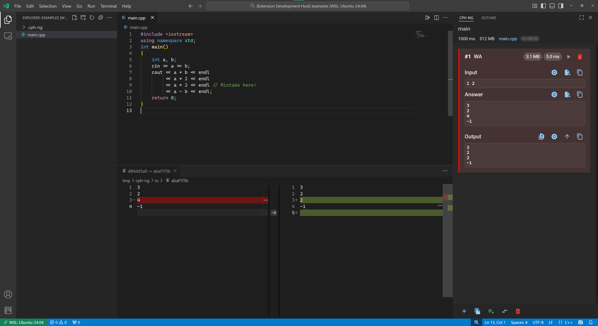
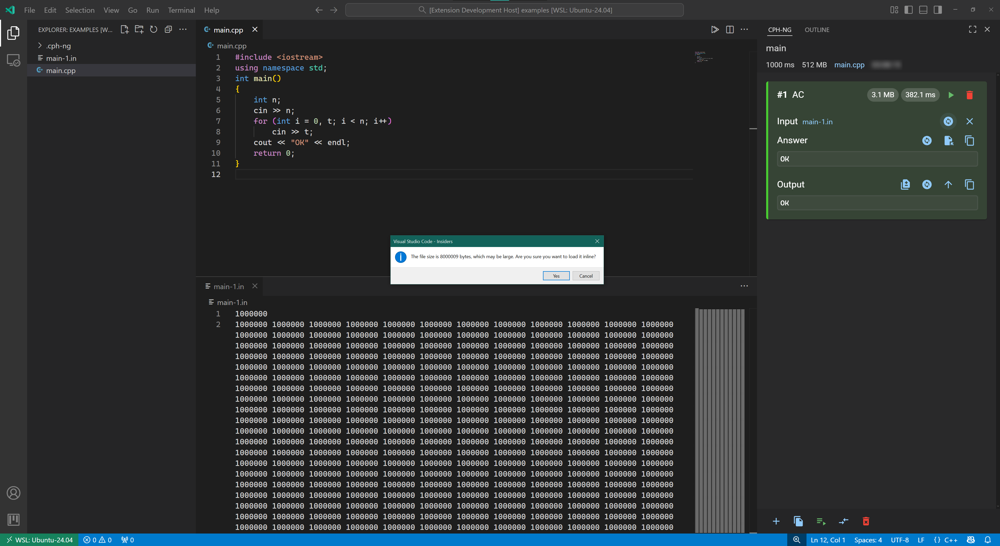
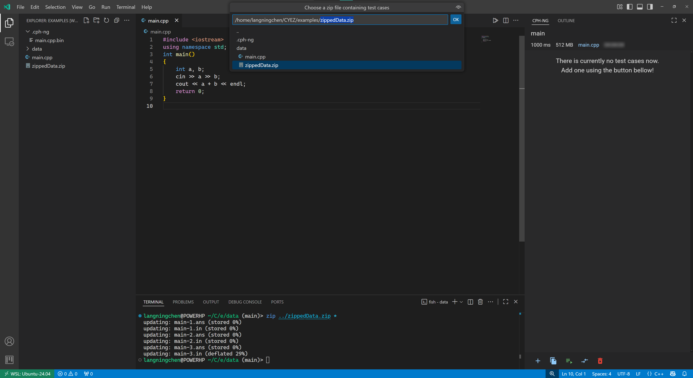
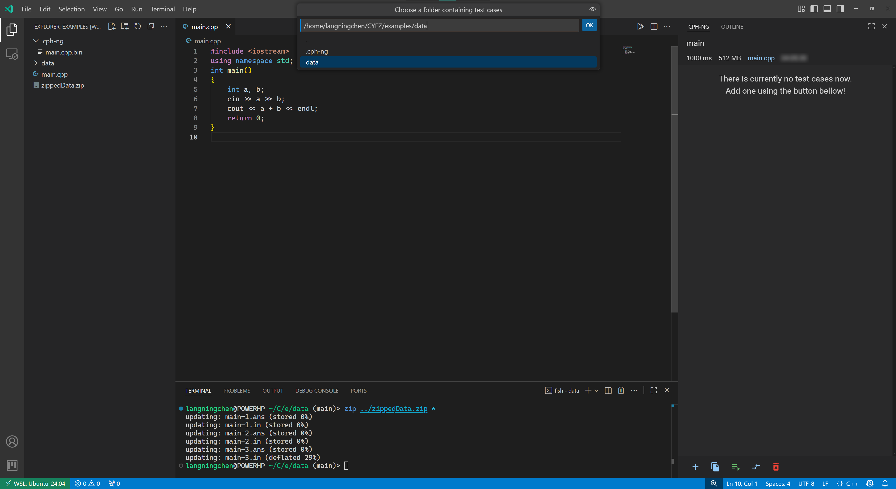
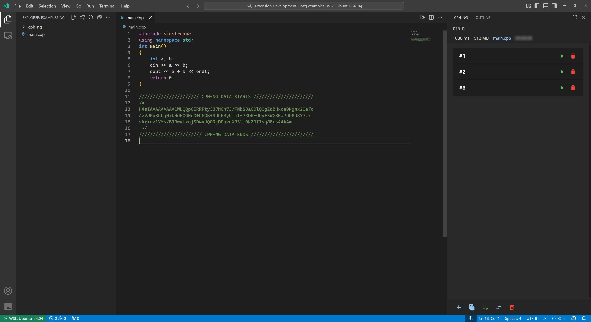
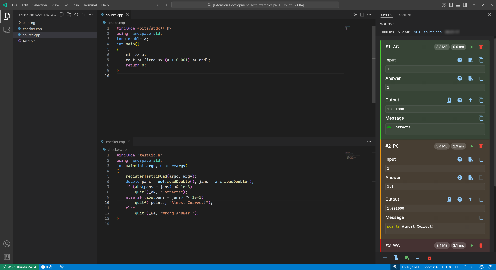

# Modules

This page covers additional modules and features. For the basic operations—creating a problem, adding test cases, and running tests, please see [Quick Start](quickStart.md).

For a comprehensive guide with detailed explanations of how each feature works, see the [Feature Guide](features/index.md).

!!! info "Configuration"
    All features can be customized through [Configuration Settings](configuration.md).

## Compare with answer

If a test case returns a **WA (Wrong Answer)**, you can view the comparison
against the correct answer by clicking the leftmost button in the output area.

If you find that the current expected answer for a test case is incorrect, you
can reset it by clicking on the current answer field.

!!! tip "Configuration"
    You can customize comparison behavior in [Comparing Settings](configuration.md#comparing-settings), such as treating Presentation Error as Accepted or ignoring stderr output.

## Data Display Toggles: File & Inline

Click the `Toggle to file` button to save the data to an external file.

Conversely, if the data is currently displayed as a file, clicking this button
will toggle it to inline view.

If the file you are attempting to toggle to inline is too large, CPH-NG will
display a warning reminder.

## Load samples from files&folder

The second button from the left allows you to **load samples from zipped files
or directories**.

You have the flexibility to choose the source location for your test cases.

If you choose to load from zipped file or from a folder, you have to choose the
specific file or folder.

Finally, you must confirm which specific test cases from the source you wish to
load.

!!! note "Configuration"
    See [Problem Settings](configuration.md#problem-settings) to customize the unzip folder location, auto-deletion behavior, and whether to clear existing test cases before loading.
    
    Learn more about this feature in the [Feature Guide](features.md#loading-test-cases-from-filesfolders).

## Edit problem metadata

Click the **pen-like button** in the top-right corner of the problem panel to
enter the edit mode.

You can modify the `Title`,`URL`,`Time Limit` and `Memory Limit` by yourself.

You can also add **Special Judge (SPJ)** programs or **interactive libraries**
as required.

## Elapsed Time Tracking

CPH-NG can now record how long has it been since the problem was being created.

## Delete a problem

When a problem is no longer needed, click the **rightmost button** in the
control panel to delete it.

A confirmation dialog will appear before the problem is permanently removed.

## Load test data from embedded

Similarly, if your file already contains embedded test data (exported
previously), you can import them by using the command
`CPH-NG: Load from Embedded` and load these with ease.

## Import from CPH-NG

CPH-NG is compatible with CPH.

It's feasible to import the test data from CPH to CPH-NG.

## Special Judge

If your program requires to judge specifically, please prepare a program for
judging and add it when editing the problem.

CPH-NG supports this as well as interactive problems. Add a interactive library
in a similar way if in need.

!!! info "Learn More"
    For detailed information about Special Judge and Interactive Problems, including checker requirements and setup instructions, see the [Feature Guide - Special Judge](features.md#special-judge) and [Interactive Problems](features.md#interactive-problems) sections.
