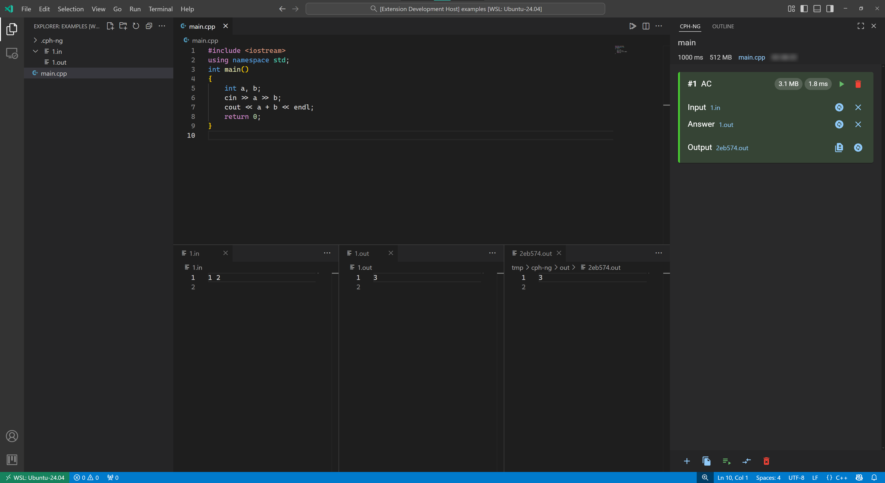

---
hide:
  - navigation
---

# 快速入门

本指南将帮助您在几分钟内开始使用 CPH-NG。有关所有功能的详细信息，请参阅 [功能指南](features/index.md)。

## 安装 { #installation }

首先，必须在您的环境中安装 CPH-NG VSCode 扩展。你可以在扩展商店中找到它。请确保您安装了最新版本。有关安装的更详细信息，你可以参考 [简介](./index.md#installation)。

安装后，您会在 VSCode 窗口的左侧找到该扩展的侧边栏图标。如果您愿意，可以将其拖到右侧。

!!! tip "首次设置"
    在创建您的第一个题目之前，您可能需要在 [配置](configuration/compilation.md) 中配置编译器设置。

## 创建一个题目

单击 `创建` 按钮后，就会创建一个题目。有关创建题目的更详细信息，可以参考 [创建题目](./features/create-problem.md)。

## 添加测试用例

题目创建后，就可以使用侧边栏底部的按钮了。

最左边的按钮用于**创建一个单独的测试用例**。您需要手动输入输入数据和预期答案（输出）。

!!! tip
    CPH-NG 还支持**从压缩文件或特定目录加载测试用例**，这是管理大型数据集的绝佳选择。

## 运行测试用例

- 要运行**单个测试用例**，请单击该测试用例旁边的绿色播放按钮。

- 要**同时运行所有测试用例**，请单击下方控制面板中间的播放按钮。

CPH-NG 会自动向您展开**第一个未通过的已评测测试用例**。

如果您从文件加载这些测试用例，输出也将显示为文件。拖动它们可以查看详细信息。

**现在，您已经学会了 CPH-NG 的基本用法。尽情享受使用 CPH-NG 编程的乐趣吧！**

## 后续步骤

- 在 [功能指南](features/index.md) 中探索所有功能
- 了解 [配置选项](configuration/index.md)
- 如果您有问题，请访问 [常见问题解答](faq.md)
